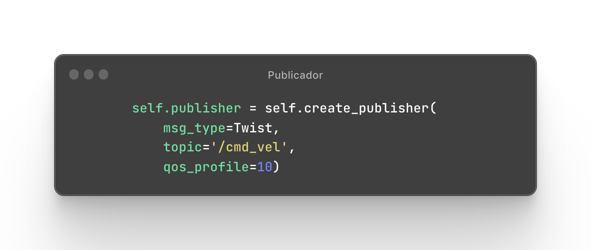
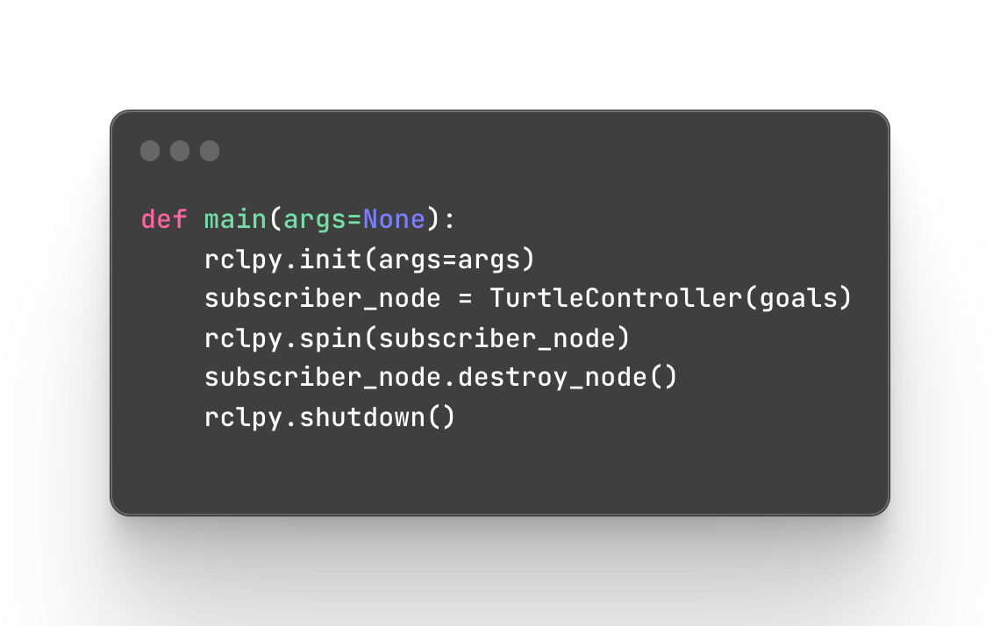

<table>
<tr>
</td>
<td>
</td>
</tr>
</table>

# Sumário
- [Autor](#autor)
- [Visão Geral do Projeto](#visão-geral-do-projeto)
- [Desenvolvimento](#desenvolvimento)
- [Referências](#referências)

# Autor
João Vitor Oliveira Rodrigues

# Visão Geral do Projeto
## Proposta
O projeto proposto pelo Instituto de Liderança e Tecnologia - INTELI, em colaboração com o professor de programação Rodrigo Mangoni Nicola, busca proporcionar aprendizado prático aos alunos do 2º ano do curso de Engenharia da Computação. O objetivo é criar um algoritmo de rotas que possa interagir com a simulação Gazebo utilizando os princípios de nós do ROS (Robot Operating System), aplicando os conhecimentos adquiridos sobre o ambiente ROS2 e o sistema operacional Ubuntu.

## Requisitos
O enunciado dessa atividade contempla os seguintes requisitos:

Para esta atividade, espera-se a capacidade demonstrável de interagir com um ambiente de simulação de robôs, gerando um movimento controlado na plataforma turtlebot3. A entrega deve ser um vídeo demonstrando o funcionamento do projeto, um texto conciso descrevendo como foi feita a implementação e o link para o repositório público no github onde foi feita a implementação.

Padrão de qualidade:

1. Setup adequado do ambiente de simulação; (peso 1)
2. Interação adequada com os tópicos relacionados ao robô simulado; (peso 2)
3. Demonstração de movimento controlado de acordo com uma rota pré-estabelecida; (peso 3)
4. Explicação coerente e concisa da implementação (min 250 caracteres e máximo 1500); (peso 2)
5. Congruência entre o que foi escrito e o código disposto no repositório do github; (peso 2)

## Desenvolvimento

&nbsp;&nbsp;&nbsp;&nbsp;&nbsp;&nbsp;Foi desenvolvido um algoritmo com o objetivo de fazer o robô se movimentar até um ponto desejado utilizando uma sequência de pontos. O algoritmo utiliza o odômetro para obter a posição atual do robô, e então realiza uma subtração contínua dessa posição até que a diferença esteja dentro de uma faixa aceitável de tolerância. Enquanto o robô estiver dentro dessa faixa, ele se move em direção ao ponto de destino. A lista de pontos é fornecida com coordenada x.
 
 
</img>
 
 
&nbsp;&nbsp;&nbsp;&nbsp;&nbsp;&nbsp;O controle do robô é feito através da subscrição do tópico '/odom' para obter os valores do odômetro, e da publicação no tópico 'cmd_vel' para enviar os comandos de velocidade.
 
 
</img>
</img>
 
 
&nbsp;&nbsp;&nbsp;&nbsp;&nbsp;&nbsp;A função listener_callback recebe os valores do odômetro e os armazenam na variavel self.x.
A função publisher_callback realiza a subtração entre a posição do robô e o ponto destino. Além disso, ela avança para o próximo ponto da lista quando o ponto atual é alcançado. Todas essas funções são chamadas e executadas pala classe TurtleController que herda da classe Node e é execultada e instânciada na função main.
 
 
</img>
 
 
Todas essas operações só são possíveis por meio das importações das bibliotecas rclpy, responsável pela comunicação com o sistema de nós do ROS, e geometry_msgs.msg e nav_msgs.msg para acessar os modelos de comunicação Twist, Point e Odometry. Esses modelos são responsáveis pela formatação dos dados recebidos e enviados pela simulação.
 
 
</img>

## Referências
TEIXEIRA. Kil Matheus Gomes. Robô Digital. Repositório Github. Disponível em: [https://github.com/Kil-Matheus/Turtlesim---Desenhando-com-Caminho](https://github.com/Kil-Matheus/Turtlesim---Desenhando-com-Caminho.git). Acesso em: 24 abr. 2023.
NICOLA,  Rodrigo Mangoni (2023). Encontro 01 - Introdução à robótica móvel.pdf . Instituto de Tecnologia e Liderança - INTELI. Disponível em: https://drive.google.com/file/d/1-dI8THMPGiNdi27UYRsY-Nfjb7Ax25D-/view?usp=sharing. Acesso em: 24 abril 2023.

